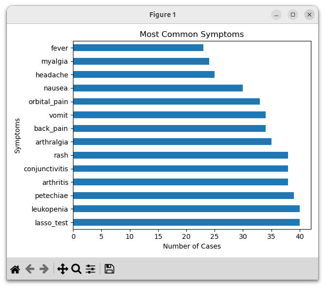
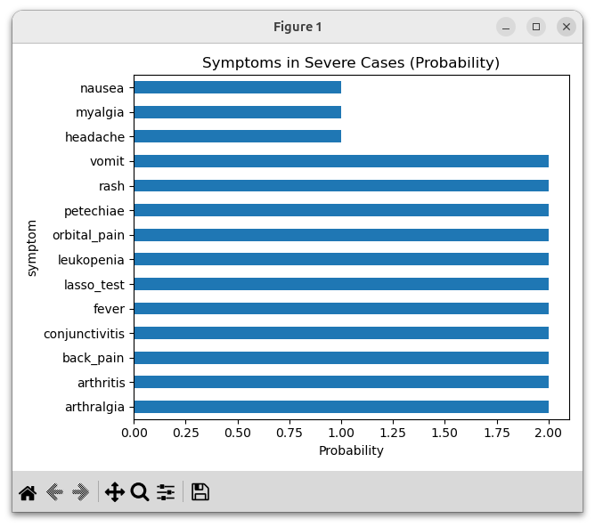
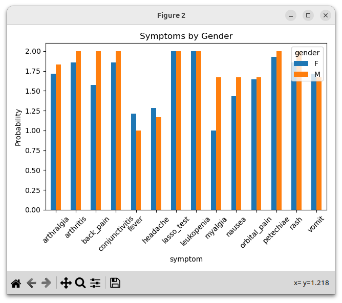

# 🦟 Arbovirus Analysis

A data analysis project focused on dengue, chikungunya and zikavirus (arbovirus) cases, transforming raw epidemiological JSON data into actionable insights through an ETL pipeline and exploratory analysis.

---

## 📌 Overview

This project processes semi-structured health data and answers key epidemiological questions such as:

* What are the most common symptoms?
* Which symptoms are associated with severe cases?
* Are there differences in symptoms by gender?

Pipeline flow:

```
Raw JSON → ETL Pipeline → Processed Dataset → Analysis → Visual Insights
```

---

## 🏗️ Project Structure

```
arbovirusanalysis/
│
├── data/
│   ├── raw/
│   ├── processed/
│
├── etl/
│   ├── extract.py
│   ├── transform.py
│   ├── load.py
│
├── analysis/
│   ├── analysis.py
│   ├── run_analysis.py
│
├── app/
│   ├── main.py
│
├── assets/
│   ├── most_common_symptoms.png
│   ├── severe_cases.png
│   ├── gender_comparison.png
│
└── README.md
```

---

## ⚙️ How to Run

### 1. Run ETL Pipeline

```bash
python3 -m app.main
```

---

### 2. Run Analysis

```bash
python3 -m analysis.run_analysis
```

---

## 📊 Visual Insights

### 🔹 Most Common Symptoms



* Highlights the most frequent symptoms across all cases
* Useful for understanding dominant patterns

---

### 🔹 Symptoms in Severe Cases



* Shows probability of symptoms among severe cases
* Helps identify potential risk indicators

---

### 🔹 Symptoms by Gender



* Compares symptom distribution between male and female patients
* Useful for demographic analysis

---

## 🧠 Key Insights

* Fever, headache, and myalgia are the most common symptoms
* Severe cases show stronger association with specific symptoms
* Gender differences are present but generally subtle

---

## 🛠️ Tech Stack

* Python
* Pandas
* Matplotlib
* Jupyter Notebook

---

## 🚀 Future Improvements

* Add age-based analysis visualization
* Build a predictive model for severity
* Develop an interactive dashboard (Streamlit)
* Integrate real public datasets (e.g., DATASUS)

---

## 📎 Project Purpose

This project demonstrates:

* ETL pipeline design for nested JSON data
* Data transformation and feature engineering
* Analytical thinking and insight extraction
* Data visualization best practices

---

## 👤 Author

**Armando Neto**
